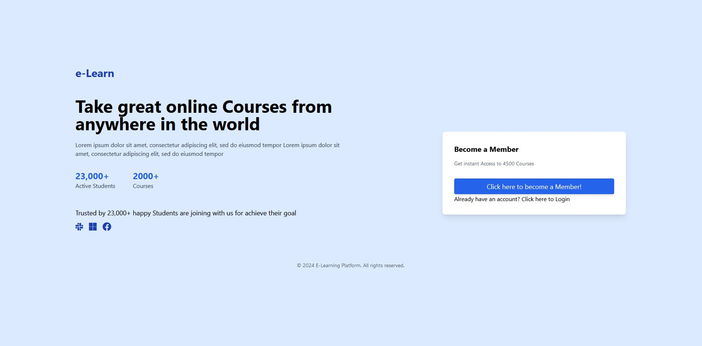

# ETI-Assignment-2

## Database Setup Instructions
1. Run `ETI_ASG2_SQL_Setup.sql`
2. Execute query in mySQL provided by the SQL script

## Website Setup Instructions
Before proceeding, ensure the database have the necessary tables. SQL script is provided.
1. Navigate to `/user-service` directory in terminal
2. Run `go run main.go` in terminal to start user & web services from user-service directory
3. Navigate to `/feedback-service` directory in terminal
4. Run `go run main.go` in terminal for feedback-service to be able to access the Review system in the web front-end
5. Open web browser, type in URL - `localhost:5000` and it should show the index page

## Design Considerations
The platform follows a microservices architecture to enhance scalability, maintainability, and overall efficiency. Here's an overview of the key components:

1. **User Service:** Manages user authentication, authorization, and profile information.
2. **Payment Service:** Handles secure payment transactions and integrates with various payment gateways.
3. **Feedback Service:** Collects and analyzes user feedback to improve the platform and course offerings.
4. **Course Management Service:** Manages course content, including creation, updates, and version control.
5. **Enrollment Service:** Facilitates user enrollment in courses and ensures a smooth enrollment workflow.

- Microservices means the breaking down of a monolithic application into smaller, independent services that can be developed, deployed, and scaled independently. This allows for greater agility and flexibility in handling different parts of the system. are designed to be independent entities, each responsible for a specific business capability. This independence allows for teams to work on different services concurrently without tightly coupling their development cycles. They are also isolated from each other, meaning that if one service fails or experiences issues, it doesn't necessarily affect the entire system. This isolation improves fault tolerance and makes it easier to identify and address issues.

## Architecture Diagram

This is the envisioned end result of the E-Learning Platform where the front-end webpage would be able to interact with the API gateway and access the different microservices based on the user's needs, the microservices are containerized in their individual containers and is managed by a kubernetes cluster to automate the deployment process, making it easier to roll out updates and manage containerized applications. Additionally kubernetes also provides self-healing, if a container fails, Kubernetes automatically replaces or reschedules containers to maintain the desired state, enhancing application resilience. These microservices would be reading and writing information to a MYSQL database.

